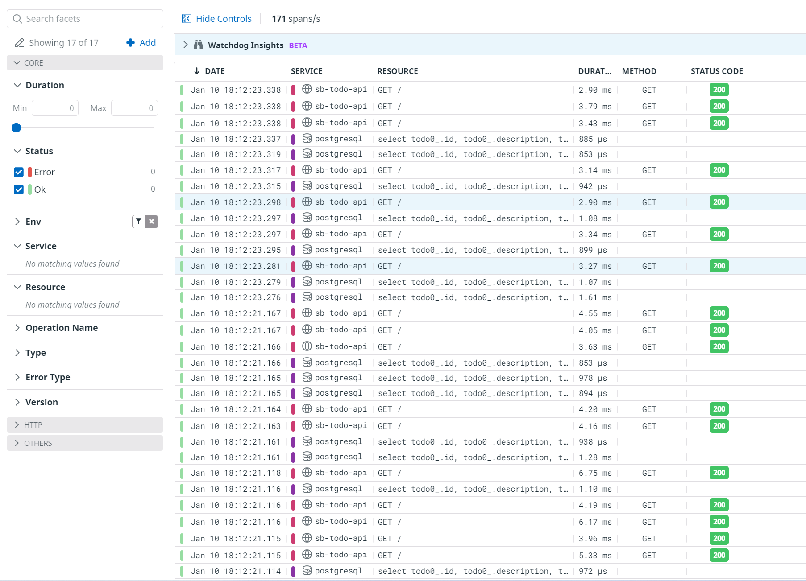

# Azure Container App sample: Spring Boot, PostgreSQL, and Datadog

This application is based on [this sample from Azure's Spring Boot docs](https://docs.microsoft.com/en-us/azure/developer/java/spring-framework/configure-spring-data-jpa-with-azure-postgresql) with all [CRUD scenarios implemented](https://github.com/joergjo/azure-containerapps-demos/blob/175fee5363e8b1199bcf28bb0e87f15c7d3f12cc/java-boot-todo-dd/src/main/java/com/example/containerapp/TodoController.java#L20) and the ability to [seed test data](https://github.com/joergjo/azure-containerapps-demos/blob/175fee5363e8b1199bcf28bb0e87f15c7d3f12cc/java-boot-todo-dd/src/main/java/com/example/containerapp/TodoApplication.java#L25) in an empty database for any Spring Profile other than `prod`.

The most interesting addition is experimental support for [Datadog](https://www.datadoghq.com/) for dsitributed tracing. Note that this is _totally_ unsupported as of yet, unless your friendly Datadog support person tells you otherwise 😉. See [below](#datadog) for more details.

## Prerequisites

- [Azure CLI 2.0](https://docs.microsoft.com/en-us/cli/azure/install-azure-cli)
- Azure Container App extension for Azure CLI

  `az extension add --source https://workerappscliextension.blob.core.windows.net/azure-cli-extension/containerapp-0.2.0-py2.py3-none-any.whl`

The application can be build on and deyployed from either Linux, macOS, or Windows. Since I've included only bash scripts, [WSL 2](https://docs.microsoft.com/en-us/windows/wsl/install) provides you the best experience if you are using Windows 10 or 11.

## Building the application on your machine

> Building the application yourself is only required if you want to change it or its configuration (e.g.
> replace PostgreSQL with MySQL).

The application has been set up using the [Spring Boot Initializer](https://start.spring.io) for JDK 11 and Maven, so follow the usual steps to build a Spring Boot application in your favorite IDE or using the command line. If you are using [Visual Studio Code](https://code.visualstudio.com/), the editor will prompt to install all recommended extensions if you don't have them installed already.

## Building the application's container image

> Building the application container images is not required. I'm providing prebuilt images on [Docker Hub](https://hub.docker.com/repository/docker/joergjo/java-boot-todo-dd).

You can use the included Docker Compose files to build your own image and push it to a registry of your choice:

```
$ cd <path-to-project-directory>
$ docker compose build
$ docker tag java-boot-todo-dd <your-registry>/java-boot-todo-dd:<your-tag>
$ docker push <your-registry>/java-boot-todo-dd:<your-tag>
```

> If you are using an older version of Docker, you may have to use `docker-compose build` (note the dash).

The included Compose files make use of [multi-stage builds](https://docs.docker.com/develop/develop-images/multistage-build/), so they will work on any machine which has Docker (or similar container build tools) installed _without_ needing a local JDK or Maven installation.

The Compose files can also be used to run the application locally:

- `compose.yaml` runs the application and the Datadog agent, but requires a separate PostgreSQL database
- `compose.dev.yaml` runs the application, the Datadog agent, and a PostgreSQL database container

## [Datadog](#datadog)

The sample includes two possible deployment topologies for the Datadog agent:

- Running in the same pod as the application container (i.e. as a sidecar): [app+sidecar](deploy/app+sidecar)
- Running as a standalone Container App in the same environment: [app+agent](deploy/app+agent)

I have included the following Datadog configuration options for the application in its ARM template. See the Datadog documentation [here](https://docs.datadoghq.com/agent/docker/?tab=standard#global-options) and [here](https://docs.datadoghq.com/tracing/setup_overview/setup/java/?tab=containers#java-installation) for more information on what these settings are being used for.

| ARM Template parameter | Maps to         | Remarks                                    |
| ---------------------- | --------------- | ------------------------------------------ |
| `ddApiKey`             | `DD_API_KEY`    | required (see [below](#deploy-to-azure))   |
| `ddEnvironment`        | `DD_ENV`        | optional, set to `staging` by default      |
| `ddServiceName`        | `DD_SERVICE`    | optional, set to `sb-todo-api` by default  |
| `ddVersion`            | `DD_VERSION`    | optional, set to `0.0.1` by default        |
| `ddSite`               | `DD_SITE`       | optional, set to `datadoghq.eu` by default |
| `ddAgentHost`          | `DD_AGENT_HOST` | set automatically depending on topology    |

# [Deploy to an Azure Container App](#deploy-to-azure)

> All scripts are hard-coded to use Azure's North Europe region, because that's one of two regions
> where Azure Container Apps are currently available. The alterantive is to deploy to Canada Central.

## Sidecar option

Run the `create_env.sh` script in the `deploy/app+sidecar` directory and provide your Datadog API Key as a parameter.

```
$ cd deploy/app+sidecar
$ ./deploy.sh <DATADOG_API_KEY>
```

This script will provision all required Azure resources to run the sample application contained in one resource group:

- An [Azure Container Apps environment](https://docs.microsoft.com/en-us/azure/container-apps/environment)
- A [Log Analytics workspace](https://docs.microsoft.com/en-us/azure/container-apps/monitor?tabs=bash). Container Apps environments require this. The application logs to stdout and hence its log will be written to the workspace, but this can be turned off.
- An [Azure Database for PostgreSQL Flexible Server](https://docs.microsoft.com/en-us/azure/postgresql/flexible-server/overview). This is required by the application.

Note that this script uses the Azure CLI to provision the required Azure resources, so as long as you don't delete these resources, you don't need to run `create_env.sh` again.

Take note of the last line this script writes to the console. It will look like this:

```
CA_RESOURCE_GROUP=cademo-1641828219 ./deploy.sh
```

The actual application deployment is performed with the script `deploy.sh`, which makes use of an Azure Resource Manager template. `CA_RESOURCE_GROUP` must be set to the name of the resource group that has been created by `create_env.sh` in order for `deploy.sh` to work. You can update the ARM template or its parameters and redeploy the application over and over again using the same command.

Run deploy.sh with `CA_RESOURCE_GROUP` set to deploy the application:

```
$ CA_RESOURCE_GROUP=cademo-1641828219 ./deploy.sh
```

Again take note of the last line this scripts prints to the console:

```
Application endpoint available at sb-todo-api.yellowbush-f77824e1.northeurope.azurecontainerapps.io
```

Congratulations, your Azure Container App is up and running! This line shows the application's endpoint you can use to access the application using any HTTP test client (e.g. [Postman](https://www.postman.com/), [curl](https://curl.se/), [wget](https://www.gnu.org/software/wget/), or [httpie](https://httpie.io/). While the application acceps both HTTPS and HTTP traffic, all HTTP requests will be redirected to the HTTPS endpoint by the [Azure Container App's ingress](https://docs.microsoft.com/en-us/azure/container-apps/ingress?tabs=bash).

If you put some load on the application (e.g. using one of the tools mentioned above or specialized tools such as [bombardier](https://github.com/codesenberg/bombardier) or [hey](https://github.com/rakyll/hey)), you should see traces show up in Datadog!


