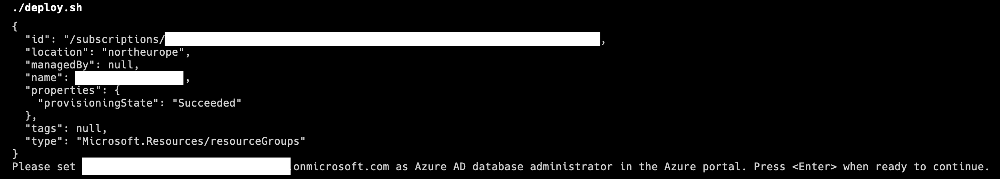

# Azure Container App sample: Spring Boot app accessing Azure Database for PostgreSQL passwordless

This application is based on a [sample To Do API from Azure's Spring Boot docs](https://docs.microsoft.com/en-us/azure/developer/java/spring-framework/configure-spring-data-jpa-with-azure-postgresql) and has been enhanced to
- use structured JSON logging with [logback](https://logback.qos.ch)
- [seed test data](https://github.com/joergjo/azure-containerapps-demos/blob/175fee5363e8b1199bcf28bb0e87f15c7d3f12cc/java-boot-todo-dd/src/main/java/com/example/containerapp/TodoApplication.java#L25) in an empty database for any Spring Profile other than `prod`
- use a [User-assigned Managed Identity](https://learn.microsoft.com/en-us/azure/active-directory/managed-identities-azure-resources/overview) to [access the PostgreSQL database "passwordless"](https://learn.microsoft.com/en-us/azure/developer/java/spring-framework/migrate-postgresql-to-passwordless-connection).

At the time of writing, the official Azure documentation for passwordless connections  covers the use of Azure Database for PostgreSQL *Single Server*. Setting up Azure AD support for Flexible Server works differently and is currently not detailed in the documentation for an end-to-end scenario. 

This sample also demonstrates how to use a User-assigned Managed Identity, 
because it solves the otherwise inevitable chickend-and-egg problem&mdash;
the application cannot be deployed unless the database model exists, 
but authorizing the application to access the database requires the application
to exist if a System-assigend Managed identity is used...

## Prerequisites

- [Azure CLI 2.0](https://docs.microsoft.com/en-us/cli/azure/install-azure-cli) (**v2.30** or newer)
- Azure Container App extension for Azure CLI

  ```bash
  az extension add --name containerapp --upgrade  
  ```
- Bicep extension for Azure CLI
  ```bash
  az bicep upgrade
  ``` 
- A bash shell. On Windows 10/11, [WSL 2](https://docs.microsoft.com/en-us/windows/wsl/install) provides you the best experience.


## [Deploy to an Azure Container App](#deploy-to-azure)

The included [`deploy.sh`](deploy/deploy.sh) script allows you to deploy the application as an Azure Container App with all required dependencies.

Before running the script, you must export the following environment variables:

| Environment variable              | Purpose                               | Default value                   |
| --------------------------------- | ------------------------------------- | ------------------------------- |
| `CONTAINERAPP_RESOURCE_GROUP`     | Resource group to deploy to           | none                 |
| `CONTAINERAPP_POSTGRES_LOGIN`     | PostgreSQL admin user login           | none                 |
| `CONTAINERAPP_POSTGRES_LOGIN_PWD` | PostgreSQL admin user password        | none                 |

> `CONTAINERAPP_POSTGRES_LOGIN` and `CONTAINERAPP_POSTGRES_LOGIN_PWD` designate a regular,
> non-Azure AD integrated PostgreSQL admin user. This user is currently required for deployment, but
> _not_ used afterwards. 

Next, execute `deploy.sh`:

```bash
cd <path-to-project-directory>/deploy
export CONTAINERAPP_RESOURCE_GROUP=todoapi-passwordless
export CONTAINERAPP_POSTGRES_LOGIN=flexadmin
# Add non-letter characters to satisfy password strength requirement 
export CONTAINERAPP_POSTGRES_LOGIN_PWD="$(openssl rand -hex 20)##"
./deploy.sh
```

The script relies on the user principal name of the user that is currently 
logged in to Azure CLI. This allows you to run the application locally without any modifications, since the Azure AD plugin in PostgreSQL will
[probe for a way to log in to Azure if no managed identity is available](https://learn.microsoft.com/en-us/java/api/overview/azure/identity-readme?view=azure-java-stable#authenticate-a-user-assigned-managed-identity-with-defaultazurecredential).    

The current version of the script stops before deploying the application since the API version required to set an Azure AD administrator for Azure Database for PostgreSQL Flexible Server has not yet been published. 
Instead the script will prompt you to [set the Azure AD administrator using the Azure portal](https://learn.microsoft.com/en-us/azure/postgresql/flexible-server/how-to-configure-sign-in-azure-ad-authentication). Make sure to set the same user as admininistrator that is logged in to Azure CLI, otherwise the deployment will fail. 
So if `joerg@example.org` is currently logged in to Azure CLI when running 
the script, `joerg@example.org` must also be set as Azure AD administrator for PostgreSQL. 

Once you have set the Azure AD admininistrator, press Enter to continue running the script.  




## Deployment Options

You can control additional deployment details (e.g., the Azure region to deploy to) by exporting the following environment variables:

| Environment variable              | Purpose                               | Default value                   |
| --------------------------------- | ------------------------------------- | ------------------------------- |
| `CONTAINERAPP_LOCATION`           | Azure region to deploy to             | `westeurope`                    |
| `CONTAINERAPP_NAME`               | Name of the Azure Container App       | `todoapi`                       |
| `CONTAINERAPP_IMAGE`              | Application container image           | `joergjo/java-boot-todo:stable` |
| `CONTAINERAPP_POSTGRES_DB`        | Database name used by the application |  `demo`                         |


## Deployed Resources

The script and the included Bicep templates create the following Azure resources:
- An [Azure Container App environment](https://docs.microsoft.com/en-us/azure/container-apps/environment).
- An [Azure Container App](https://learn.microsoft.com/en-us/azure/container-apps/overview) for the application.
- A [Log Analytics workspace](https://docs.microsoft.com/en-us/azure/container-apps/monitor?tabs=bash). Container Apps environments require this. The application logs to stdout and hence its log will be written to the workspace, but this can be turned off.
- An [Azure Database for PostgreSQL Flexible Server](https://docs.microsoft.com/en-us/azure/postgresql/flexible-server/overview) that supports Azure AD authenticatiob. This is required by the application.
- [A Virtual Network for the Container Apps environment](https://docs.microsoft.com/en-us/azure/container-apps/vnet-custom?tabs=bash&pivots=azure-cli). Since the deployment script  needs access to the PostgreSQL server, the Flexible Server is currently
_not_ injected in this network, but will be in a later version. 
- A [User-assigned Managed Identity](https://learn.microsoft.com/en-us/azure/active-directory/managed-identities-azure-resources/overview) for the application.


## Building the application (optional)

### Building the application on your machine

Building the application yourself is only required if you want to change it or its configuration (e.g. replace PostgreSQL with MySQL).

The application has been set up using the [Spring Boot Initializer](https://start.spring.io) to use JDK 17 and Maven, so follow the usual steps to build a Spring Boot application in your favorite IDE or using the command line. If you are using [Visual Studio Code](https://code.visualstudio.com/), the editor will prompt to install all recommended extensions if you don't have them installed already.

As mentioned before, in order to run the application locally, you must provide an alternate identity that the application can use to log in to Azure AD. 
The simplest option is to make sure you are logged in to Azure CLI and your user has been granted access to the Flexible Server. If you have set up
the Flexible Server with the included deployment script, this will be the case. 

### Building the application's container image

Prebuilt images are available on [Docker Hub](https://hub.docker.com/repository/docker/joergjo/java-boot-todo). This container image is used when you deploy the application with the included scripts.

If you want to build your own container image, use the included Docker Compose files:

```bash
$ cd <path-to-project-directory>
$ docker compose build
$ docker tag java-boot-todo <your-registry>/java-boot-todo:<your-tag>
$ docker push <your-registry>/java-boot-todo:<your-tag>
```

> If you are using an older version of Docker, you may have to use `docker-compose build` (note the dash).

The included Compose files make use of [multi-stage builds](https://docs.docker.com/develop/develop-images/multistage-build/), so they will work on any machine which has Docker (or similar container build tools) installed _without_ needing a local JDK or Maven installation.

The Compose files can also be used to run the application locally:

- `compose.yaml` runs the application locally, but requires a separate PostgreSQL database.
- `compose.all.yaml` runs the application and a PostgreSQL database container. In this case, username and password are used instead of Azure AD.

